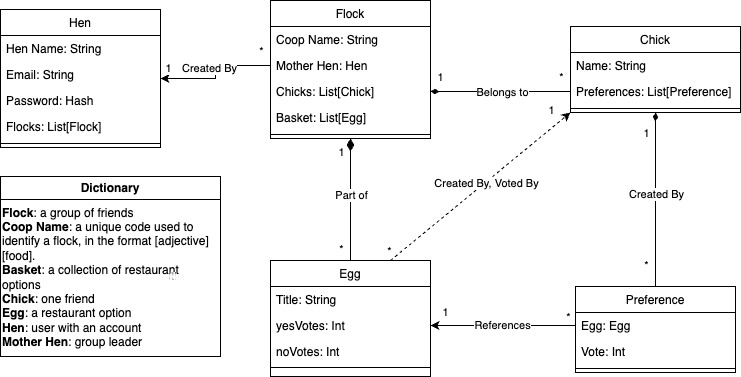

# Chicken Tinder

This is the monorepo for Chicken Tinder.

Product Vision: For friend groups who can’t decide where to eat in a timely manner, Chicken Tinder is a web app that collects food preferences within groups and picks a restaurant catered to the group’s preferences. Unlike Yelp, our product enables collaboration within customizable groups of users.

The deployed app can be viewed at: https://thechickens.netlify.app

And the backend can be accessed from: https://chickentinder-backend.azurewebsites.net/

[Here is a video demo of our product](https://drive.google.com/file/d/1Eo5CBs-h_l4akQ4Ad6qsmYZaXKlyAX-n/view?usp=sharing) (last updated 3/13/24)

## Artifacts

UI prototypes and designs are located in Figma (last updated 2/27/24):

-   [Designs](https://www.figma.com/file/NYJDxRDX5nzyrkO2d03S7I/Chicken-Tinder?type=design&node-id=0%3A1&mode=design&t=a2ww8RXXaC2aStSE-1)
-   [Prototype](https://www.figma.com/proto/NYJDxRDX5nzyrkO2d03S7I/Chicken-Tinder?type=design&node-id=269-111&t=7F6iy4C3B3gihSNp-0&scaling=min-zoom&starting-point-node-id=269%3A111&show-proto-sidebar=1)

Class diagram (last updated 3/12/24): 

## Development

This script clones the repo (with SSH) and creates the necessary `.env` files. The backend env file must be configured with the relevant secrets. The JWT secret key can be any string.

```
git clone git@github.com:the-chickens-x5/chicken-tinder.git
cd chicken-tinder
npm install
echo 'DB_PASSWORD=copy_password_here \nTENOR_API_KEY=copy_key_here \nJWT_SECRET_KEY=copy_key_here' > ./packages/backend/.env
echo 'REACT_APP_API_URL=http://localhost:8000' > ./packages/frontend/.env
```

To start up local instances:

```
npm run backend-dev
npm run frontend-dev
```

Before commiting/pushing, maintain style conventions with:

```
npm run format
npm run lint
```

To run Cypress testing:

```
npm cy:run
npm test
```

### Frontend Environment Variables

In general, if you want to add your own env variable, use `REACT_APP_{varname}={varval}`. Then you can read it with `process.env.REACT_APP_{varname}`.
